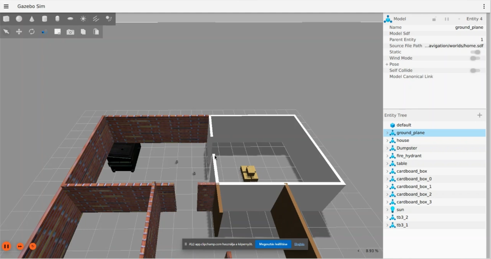

[//]: # (Image References)

[image1]: ./assets/two_robots.jfif "picture of two robots"
[image2]: ./assets/merged_map.jfif "picture of two maps merged"

# Multi-Robot SLAM Navigation with ROS2
This project presents a multi-robot Simultaneous Localization and Mapping (SLAM) system, implemented using the Robot Operating System 2 (ROS2) and Gazebo simulation environment. The system involves two mobile robots that operate in a shared simulated world, where they independently and simultaneously perform mapping and localization tasks
The robots are equipped with LiDAR sensors and use the SLAM Toolbox to build an internal map of the environment while estimating their own positions in real-time. The key objective of the project is to enable the robots to collaboratively explore an unknown environment and build accurate occupancy grids (maps).
This implementation demonstrates core principles of:
- SLAM in multi-robot systems
- Sensor fusion
- Distributed robotic coordination
- Real-time map generation

## YouTube video:
<a href="https://youtu.be/Exqm_VrOytY"></a>

## Overview
This project implements a multi-robot SLAM (Simultaneous Localization and Mapping) system using ROS2 Jazzy and the Gazebosimulation platform. The environment simulates two autonomous robots navigating in the same world, each running its own SLAM process, while building and updating a map in real time.
The system is modular and extensible, designed for educational and experimental purposes in multi-agent robotics. It supports both the SLAM Toolbox and Google Cartographer as SLAM backends, allowing comparative testing and flexible development.
Key components of the system include:
- Launch infrastructure to start the world, spawn multiple robots, and assign them unique namespaces and parameters
- URDF and mesh models of TurtleBot3 robots for Gazebo visualization and physics simulation
- Configuration files for SLAM and localization (e.g. `slam_toolbox_mapping_1.yaml`, `cartographer_1.lua`)
- RViz setup for real-time monitoring of robot positions and the evolving occupancy grid maps

## Installation & Setup
This guide will walk you through setting up the environment required to run the Multi-Robot SLAM Simulation project using ROS2 Jazzy and Gazebo Harmonic.

### Prerequisites 
Before you begin, ensure the following are installed on your system:
- MOGI TurtleBot3 repositories
- Ubuntu 24.04 LTS
- ROS2 Jazzy
- Gazebo Harmonic

### Install Required ROS2 Packages
```bash
sudo apt update
sudo apt install -y \
  ros-jazzy-slam-toolbox \
  ros-jazzy-cartographer \
  ros-jazzy-cartographer-ros \
  ros-jazzy-robot-state-publisher \
  ros-jazzy-teleop-twist-keyboard \
  ros-jazzy-rviz2 \
  python3-colcon-common-extensions
```

### Clone the Project
Create workspace:
```bash
mkdir -p ~/ros2_ws/src
cd ~/ros2_ws/src
```
Clone the project into workspace
```bash
git clone -b map_merge_branch https://github.com/szandamarci/ROSS2.git
```

### Environment Configuration
The TurtleBot3 burger model type is used:
```bash
echo "export TURTLEBOT3_MODEL=burger" >> ~/.bashrc
source ~/.bashrc
```

### Build the Workspace
```bash
cd ~/ros2_ws
colcon build
source install/setup.bash
```

### Run the Simulation
```bash
ros2 launch multi_robot_navigation launch
```


## How it works
In this section we are going to detail how the launch files are structured, and how multi robot map merging was implemented.
Each robot is initialized with its own namespace and configuration, allowing them to run independently without topic collisions. The robots can be launched either with SLAM Toolbox or Cartographer via the provided launch files:
- `multirobot_mapping_slam_toolbox.launch.py`
- `multirobot_mapping_cartographer.launch.py`
The robots spawn using the `spawn_robot.launch.py` script, and the simulation environment is brought up with `world.launch.py`.

### Namespaces
Namespaces are used to avoid topic collisions of multiple instances of the same nodes. In our case the two namespaces for the different TurtleBots are `tb3_1` and `tb3_2`. Publishing data to different topics is done by starting two separate nodes for each robot. For example, two `robot_state_publisher` nodes are launched, each within its own namespace: `tb3_1` and `tb3_2`. The first node publishes to topics like `/tb3_1/joint_state` and `/tb3_1/robot_description`, while the second publishes to `/tb3_2/joint_states` and `/tb3_1/robot_description`. This separation ensures that each robot's data remains isolated and does not interfere with the other robot's topics or TF frames.

### Spawning
The `spawn_robot.launch.py` file is responsible for spawning the two uniquely named robots in a Gazebo world. It also starts publishing their states and localization data, and bridges essential Gazebo simulation data (including camera feeds).
The two robots are spawned with the `spawn_urdf_node_1` and `spawn_urdf_node_1` nodes, which use the `\create` service of the `ros_gz_sim` package. Initial positions are determined by launch arguments for `x` and `y`.

![alt text][image1]

Each robot gets its own `robot_state_publisher` node under their unique namespace, which publishes TFs for the robot's joints and links using its URDF.
The robots also get unique EKF nodes for localization from the `robot_localization` package, essential for sensor fusion and smooth odometry. The same `ekf.yaml` configuration file is used for both nodes.

The `spawn_robot.launch.py` also contains the Gazebo-ROS bridge for topics and image.

### SLAM
The SLAM algoryithm is started in the `multirobot_mapping_slam_toolbox.launch.py` launch file with the `start_async_slam_toolbox_node_1` and `start_async_slam_toolbox_node_2` nodes.

This launch file also contains a static transform nodes, which publishes static TFs between the `world` and each robot's map frame.

### Manual control
The robots are controlled by starting the `interactive_marker_twist_server_node_1` and `interactive_marker_twist_server_node_2` nodes in the `multirobot_mapping_slam_toolbox.launch.py` launch file. This lets users manually control each robot in RViz. The `\cmd_vel` is remapped to each robot's namespaced topic (`/tb3_X/cmd_vel`).

### Map merging
The map merge package was downloaded from [this github page](https://github.com/abdulkadrtr/mapMergeForMultiRobotMapping-ROS2.git). It creates a node, which subscribes to two different map messages `/map1` and `/map2`, merges them, and publishes the merged map to the `/merge_map` topic. The content of the package is launched with the following command: `ros2 launch merge_map merge_map_launch.py`, which is called in the `multirobot_mapping_slam_toolbox.launch.py` launch file.
The merged map can be exported with the following command:
```bash
ros2 run nav2_map_server map_saver_cli -f my_map
```
The following .pgm file produced by the above command is seen here:

![alt text][image2]


